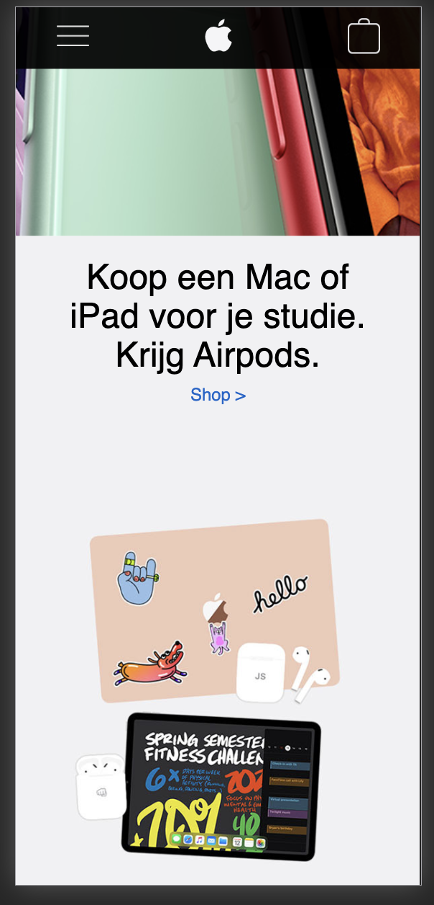
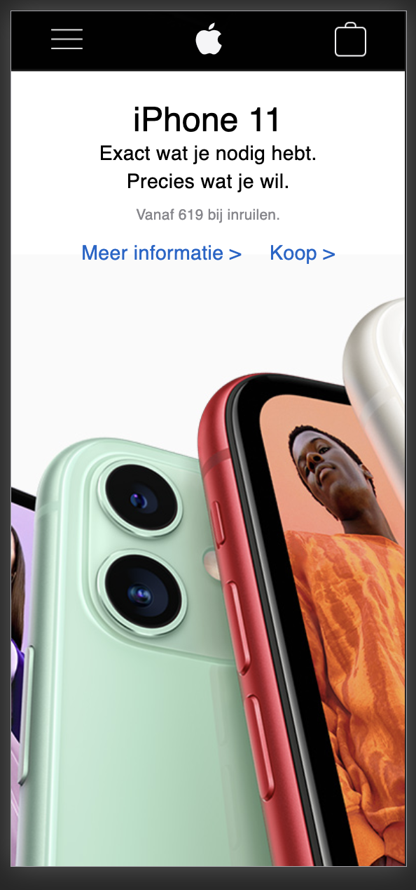
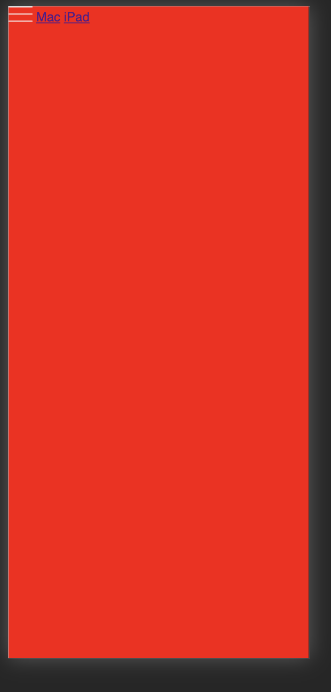
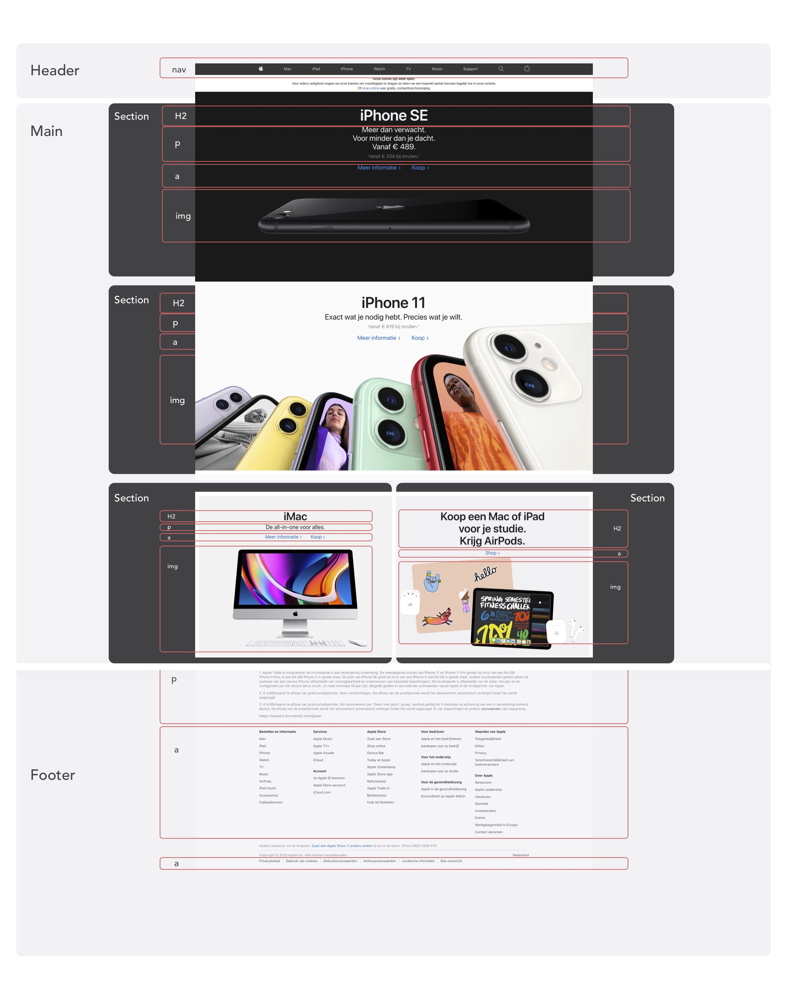

# Procesverslag
**Auteur:** -jouw naam-

Markdown cheat cheet: [Hulp bij het schrijven van Markdown](https://github.com/adam-p/markdown-here/wiki/Markdown-Cheatsheet). Nb. de standaardstructuur en de spartaanse opmaak zijn helemaal prima. Het gaat om de inhoud van je procesverslag. Besteedt de tijd voor pracht en praal aan je website.

## Bronnenlijst
1. -bron 1-
2. -bron 2-
3. -...-

## Eindgesprek (week 7/8)

-dit ging goed & dit was lastig-

**Screenshot(s):**

-screenshot(s) van je eindresultaat-

## Voortgang 3 (week 6)

-same as voortgang 1-

## Voortgang 2 (week 5)

-same as voortgang 1-

## Voortgang 1 (week 3)

### Stand van zaken

-dit ging goed & dit was lastig-

In het begin vond ik het erg lastig om te beginnen. De HTML schrijven ging nog wel reddelijk. De css was echter een stuk lastiger veel dingen moest ik telkens opniew opzoeken. Wat ook nieuw voor mij was was het gebruik van section:nth-of-type(1) maar toe ik dit eenmaal door had ging het een stuk beter.
Toen ik eenmaal bezig was met de code merkte ik dat het best reddelijk ging. Waar ik nog wel veel moeite mee had was met de code van het hamburgermenutje.
De opmaak hiervan is nog wel lastig.

**Screenshot(s):**

-screenshot(s) van hoe ver je bent-

### Agenda voor meeting

-samen met je groepje opstellen-

### Verslag van meeting

-na afloop snel uitkomsten vastleggen-

## Intake (week 1)

**Je startniveau:** -Blauw-

**Je focus:** -Surface plane-

**Je opdracht:** -https://www.apple.com/nl/-

**Screenshot(s):**

**Breakdown-schets(en):**

