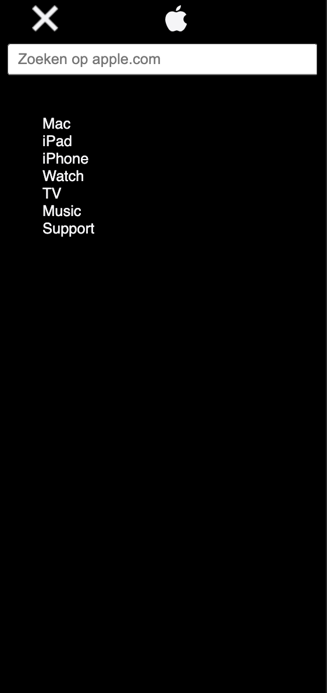

# Procesverslag
**Auteur:** Sophia Delenardo

Markdown cheat cheet: [Hulp bij het schrijven van Markdown](https://github.com/adam-p/markdown-here/wiki/Markdown-Cheatsheet). Nb. de standaardstructuur en de spartaanse opmaak zijn helemaal prima. Het gaat om de inhoud van je procesverslag. Besteedt de tijd voor pracht en praal aan je website.

## Bronnenlijst
1. apple.com
2. -bron 2-
3. -...-

## Eindgesprek (week 7/8)

-dit ging goed & dit was lastig-

**Screenshot(s):**

-screenshot(s) van je eindresultaat-

## Voortgang 3 (week 6)

### Stand van zaken

-screenshot(s) van hoe ver je bent-

## Voortgang 2 (week 5)

-same as voortgang 1-

### Stand van zaken

Ik ben bezig geweest met het stijlen van het uitgeplakte hamburgermenu. Hier liep ik wel vast namelijk met het stijlen van het list met de linkjes naar de verschillende pagina's.
Daarnaast heb ik geprobeerd om een animatie te maken van het uitklappen van een hamburger menu, dit
lukte echter niet. Ik heb hier veel tijd ingestoken.
Waar ik wel tevreden over was was het stukje JavaScript dat ik heb gebruikt.

-screenshot(s) van hoe ver je bent-

Vragen

- Hoe maakt ik een animatie van het uitklappen van een hamburgermenu?
- Hoe krijg ik een lijntje onder de tekst van de linkjes in mijn menu?

## Voortgang 1 (week 3)

### Stand van zaken

Om een begin te maken aan de site zag ik erg tegen op.
Ik wist niet meer zo goed hoe alles moest. HTML ging opzicht wel prima maar met css was het lastiger. Wat ik lastig vind is dat ik vaak in theorie wel weet hoe het werkt maar dan dat er bij het uitwerkne ervan dingen mis gaan. Vervolgens lukt het dan vaak niet om te achterhalen wat er nou precies mis is gegaan. Daarnaast was het maken van het hamburgermenu best een uitdaging.
Desondanks had ik niet verwacht dat ik de code die ik nu heb had kunnen schrijven.
**Screenshot(s):**

-screenshot(s) van hoe ver je bent-

### Agenda voor meeting

-samen met je groepje opstellen-

### Verslag van meeting

-na afloop snel uitkomsten vastleggen-
Ik heb van de studenten assistenten wat tips gekregen om in de tweede pagina een courusel te gebruiken.
Ook heb ik een linkje ontvangen voor het maken van een hamburgermenu.

## Intake (week 1)

**Je startniveau:** -kies uit zwart, rood óf blauw-

**Je focus:** -kies uit responsive óf surface plane-

**Je opdracht:** -link naar de website die je gaat namaken óf de naam van je eigen ontwerp-

**Screenshot(s):**

**Breakdown-schets(en):**

